<picture>
  <source media="(prefers-color-scheme: dark)" srcset="assets/banner-dark.svg">
  
</picture>

### What I work on

- SaaS platforms built on Laravel, including multi-tenant apps
- APIs and microservices in PHP and TypeScript
- Data pipelines and migrations in Python
- Docker environments and cloud infrastructure on AWS and GCP

### Stack

<picture>
  <source media="(prefers-color-scheme: dark)" srcset="assets/stack-dark.svg">
  
</picture>

Plus Livewire and Filament on the Laravel side.

### Contributions

<picture>
  <source media="(prefers-color-scheme: dark)" srcset="https://raw.githubusercontent.com/JavierxHernandez/JavierxHernandez/output/snake-dark.svg">
  
</picture>

### Find me on

<a href="https://www.linkedin.com/in/javierxhernandez/"><picture><source media="(prefers-color-scheme: dark)" srcset="assets/linkedin-dark.svg"></picture></a>&nbsp;
<a href="https://instagram.com/javierhehe"><picture><source media="(prefers-color-scheme: dark)" srcset="assets/instagram-dark.svg"></picture></a>
